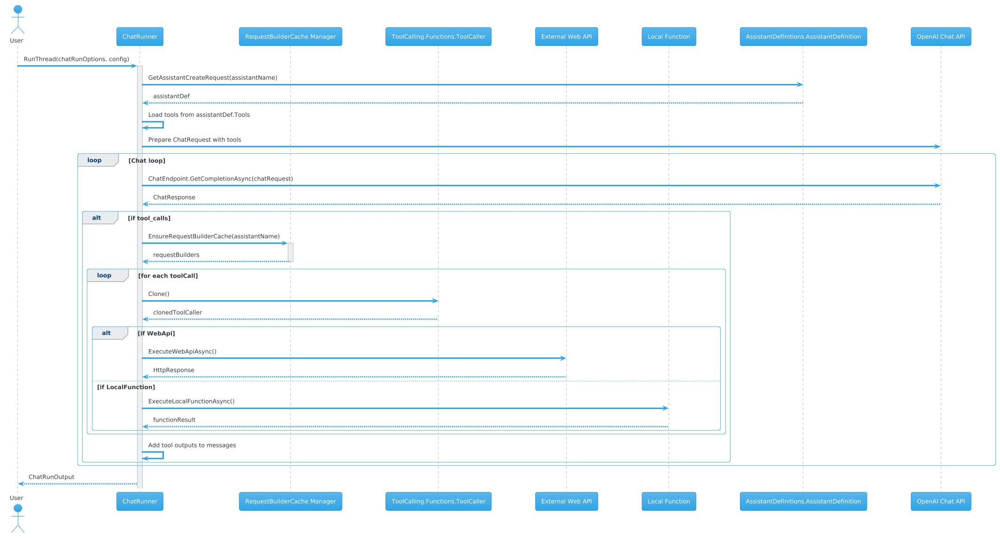

# AntRunner.ToolCalling

The **AntRunner.ToolCalling** library provides a fully decoupled framework for defining and executing tool calls within AI assistant workflows. It separates assistant definitions and tool calling logic from the Assistants API, enabling flexible integration with any .NET library that supports the OpenAI Chat Completions API.

## Purpose

This library enables assistants to dynamically invoke external tools or functions during conversations. Tools can be defined using OpenAPI specifications or as local functions, and the library manages the execution of these tools, including handling web API requests and processing responses.

## Key Features

- **Tool Definition and Execution:** Supports defining tools as OpenAPI-based web APIs or local functions, with automatic request building and response handling.
- **Request Builder Caching:** Efficiently caches tool callers per assistant to optimize repeated tool invocations.
- **Asynchronous Tool Calls:** Executes multiple tool calls concurrently and integrates their outputs back into the assistant conversation.
- **Schema Validation and Filtering:** Validates OpenAPI specifications and filters API responses according to defined schemas.
- **Seamless Integration:** Designed to work with any .NET application using OpenAI's Chat Completions API for assistant interactions.

## Usage Example

The `AntRunner.Chat.ChatRunner` class illustrates how to use the **AntRunner.ToolCalling** library in practice. It demonstrates:

- Loading assistant definitions and associated tools.
- Converting tool definitions into OpenAI-compatible function calls.
- Running chat loops that handle tool call requests from the assistant.
- Executing required tool calls asynchronously and appending their results to the conversation.
- Managing conversation flow and optional evaluation.

---

This sequence diagram illustrates the interaction between the `ChatRunner` class and the `AntRunner.ToolCalling` library during a chat run, highlighting tool calling lifecycle and execution.

For detailed implementation and usage, see the source code in `\AntRunner\AntRunner.Chat\AntRunner.Chat\ChatRunner.cs`.
